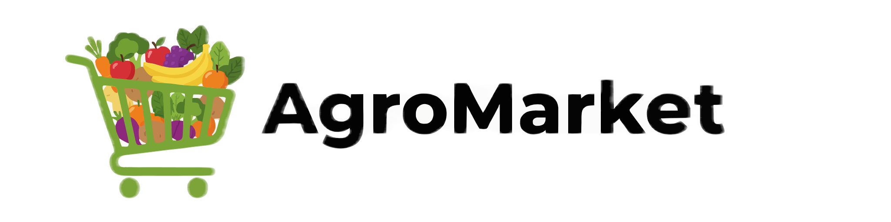

<p align="center">
  <a href="http://agromarket.test" target="_blank">
    
  </a>
</p>

<p align="center">
    <a href="https://laravel.com"></a>
    <a href="https://php.net"></a>
    <a href="https://stripe.com"></a>
</p>

# AgroMarket

**AgroMarket** es una plataforma de comercio electrónico diseñada para conectar directamente a agricultores con consumidores finales, eliminando intermediarios y promoviendo el comercio justo. Nuestra misión es potenciar la economía local y ofrecer productos frescos y de calidad a precios accesibles.

## 🚀 Características Principales

- **Gestión de Usuarios**: Roles diferenciados para Administradores, Agricultores y Clientes.
- **Catálogo de Productos**: Los agricultores pueden gestionar sus propios productos, inventario y precios.
- **Carrito de Compras**: Sistema de carrito intuitivo y persistente.
- **Pagos Seguros**: Integración completa con **Stripe** para procesar pagos con tarjeta de crédito/débito.
- **Facturación Electrónica**: Generación automática de comprobantes de pago.
- **Gestión de Pedidos**: Seguimiento de estados de pedido (Pendiente, Procesando, Enviado, Entregado).
- **Seguridad Avanzada**:
    - Protección contra ataques de fuerza bruta en el login.
    - Prevención de vulnerabilidades IDOR (Insecure Direct Object References).
    - Protección contra Mass Assignment.
    - Cabeceras de seguridad HTTP (HSTS, X-Frame-Options, etc.).
    - Sanitización de logs para prevenir fugas de información.
    - Rate Limiting en formularios de contacto para evitar spam.
    - Gestión atómica de inventario para prevenir sobreventa.

## 🛠️ Stack Tecnológico

- **Backend**: Laravel 11 (PHP 8.2+)
- **Frontend**: Blade Templates, Vanilla JS, CSS3 (Diseño Responsivo)
- **Base de Datos**: MySQL / MariaDB
- **Pagos**: Stripe API
- **Servidor**: Apache / Nginx

## ⚙️ Instalación y Configuración

Sigue estos pasos para levantar el proyecto en tu entorno local:

1.  **Clonar el repositorio**
    ```bash
    git clone https://github.com/tu-usuario/agromarket.git
    cd agromarket
    ```

2.  **Instalar dependencias de PHP**
    ```bash
    composer install
    ```

3.  **Instalar dependencias de Frontend**
    ```bash
    npm install
    npm run build
    ```

4.  **Configurar variables de entorno**
    ```bash
    cp .env.example .env
    ```
    Actualiza el archivo `.env` con tus credenciales de base de datos y claves de API (Stripe, etc.).

5.  **Generar clave de aplicación**
    ```bash
    php artisan key:generate
    ```

6.  **Ejecutar migraciones y seeders**
    ```bash
    php artisan migrate --seed
    ```

7.  **Iniciar el servidor local**
    ```bash
    php artisan serve
    ```

## 🤝 Cómo Colaborar

¡Agradecemos tu interés en mejorar AgroMarket! Si deseas contribuir, por favor sigue estos pasos:

1.  Haz un **Fork** del repositorio.
2.  Crea una nueva rama para tu funcionalidad o corrección (`git checkout -b feature/nueva-funcionalidad`).
3.  Realiza tus cambios y haz commit (`git commit -m 'Agrega nueva funcionalidad'`).
4.  Haz push a la rama (`git push origin feature/nueva-funcionalidad`).
5.  Abre un **Pull Request** describiendo tus cambios.

### Guía de Estilo
- Seguimos los estándares PSR-12 para código PHP.
- Asegúrate de que tu código pase todas las pruebas existentes.

## 📄 Licencia

Este proyecto es software de código abierto licenciado bajo la [MIT license](https://opensource.org/licenses/MIT).

---
<p align="center">Desarrollado con ❤️ para el campo.</p>
